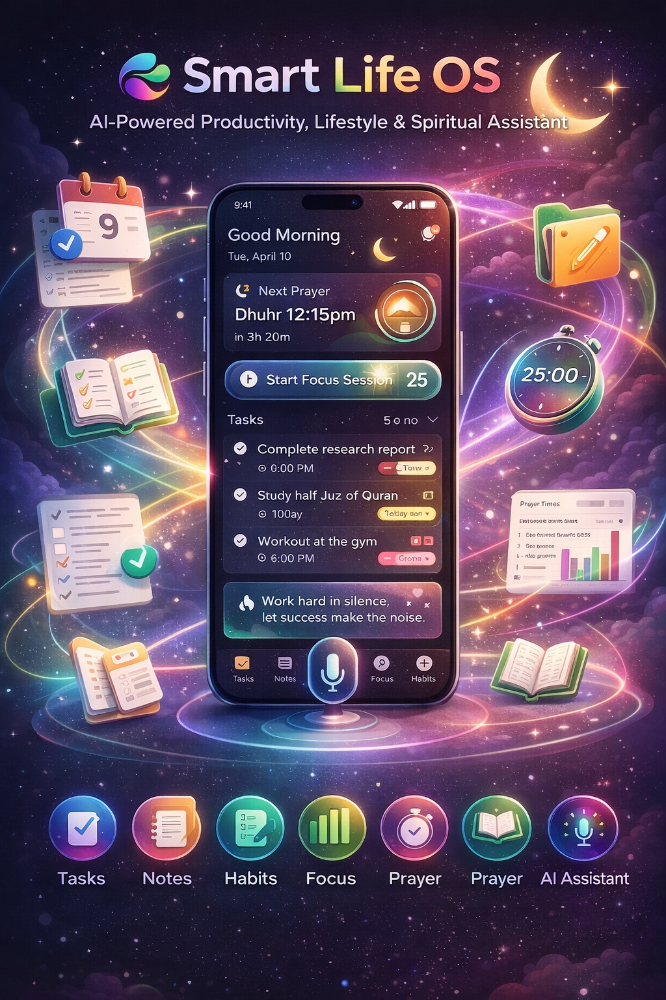

# 🚀 Smart Life Planner  
## AI-Powered Productivity, Lifestyle & Spiritual Assistant


---

# 🌍 1. Project Overview

## 💡 Proposed Concept

**Smart Life Planner ** is a **smart all-in-one productivity and lifestyle platform** designed to help users manage their **work, study, personal growth, and spiritual routines** from a single application.

Modern users often rely on multiple apps to manage their daily life:

- ✅ Task managers  
- 📝 Note taking apps  
- ⏱️ Focus timers  
- 📈 Habit trackers  
- 📓 Journaling tools  
- 🕌 Prayer apps  
- ⏰ Reminder systems  

This fragmentation causes:

- ❌ inefficiency  
- ❌ distraction  
- ❌ lack of integration between important parts of daily life  

Smart Life OS solves this problem by combining all these capabilities into **one intelligent and unified system**.

The application integrates:

- 📋 Task Management  
- 📝 Notes and Quick Capture  
- 🎯 Deep Focus Tools  
- 📊 Habit Tracking  
- 📓 Journaling and Reflection  
- 🕌 Prayer Times and Islamic Utilities  
- 🎙️ AI Voice Assistant (Arabic + English)  
- 🤖 AI Daily Planning  
- 📈 Life Analytics and Insights  

The result is **not just another productivity app**.

It becomes a **Personal Life Operating System** that intelligently helps users manage their time, goals, productivity, and personal well-being.

---

# 🎯 2. Core Vision

The goal is to create an application that behaves like:

> **🧠 Your Intelligent Life Assistant**

Instead of users constantly organizing their life manually, the system helps them:

- 📅 plan their day  
- ⚡ capture ideas instantly  
- 🎯 focus deeply  
- 🔁 maintain healthy routines  
- 📈 track personal growth  
- 🕌 stay spiritually connected  
- 🤖 receive intelligent insights about their habits and productivity  

The application merges:

**Productivity Tools + AI + Lifestyle Management**

into one seamless experience.

---

# ❗ 3. Problem Statement

People currently use **many separate apps** to manage their life.

Example:

| Purpose | Typical App |
|------|------|
| 📋 Task management | TickTick / Todoist |
| 📝 Notes | Google Keep |
| ⏱️ Focus timer | Focus To-Do |
| 📈 Habit building | Fabulous |
| 🕌 Prayer times | Muslim apps |

Using many apps creates several problems:

- 🔁 fragmented workflow  
- 📱 switching between applications  
- ⚠️ lack of integration between tasks and habits  
- 📊 difficulty understanding overall productivity  
- 🧩 disconnected personal and spiritual routines  

There is currently **no single intelligent system** that manages:

- productivity  
- personal development  
- daily planning  
- spiritual routine  
- AI assistance  

in one platform.

**Smart Life OS aims to solve this.**

---

# 👥 4. Target Audience

The application targets a **wide and growing user base**.

## 🎓 Primary Users

- 👨‍🎓 university students  
- 💻 freelancers  
- 🧑‍💼 professionals  
- 👨‍💻 developers  
- 🚀 entrepreneurs  
- 📈 productivity enthusiasts  
- 🕌 Muslim users seeking lifestyle + spiritual balance  

## 💡 Why this audience matters

These groups rely heavily on **digital tools to manage their lives**.

However, they often use **5–10 different applications simultaneously**.

Smart Life OS simplifies this by offering **a unified ecosystem**.

---

# 🔄 5. App Flow & User Journey

The application is designed to be **simple, intuitive, and intelligent**.

---

# 🧭 5.1 Onboarding Flow

When the user launches the application for the first time, the onboarding system **personalizes the experience**.

The app asks for:

- 🌐 preferred language (Arabic / English)  
- 📍 country or city  
- 🕌 prayer calculation method  
- 🎯 main goals (study / work / self improvement / fitness / spiritual growth)  
- 🌅 preferred wake-up time  
- 🌙 preferred sleep time  
- 🔔 permission for notifications  
- 🎙️ permission for microphone (voice assistant)  
- 📍 permission for location (prayer times)  

After onboarding, the system automatically configures:

- 📊 daily dashboard  
- 🕌 prayer schedule  
- 📈 default habits  
- 🤖 AI recommendations  
- 📋 initial task environment  

This makes the app feel **personalized from the first launch**.

---

# 🏠 5.2 Home Dashboard Flow

The dashboard acts as the **central control center** for the user's day.

The dashboard displays:

- 👋 greeting and current date  
- 📋 today's tasks  
- 🕌 next prayer time  
- 📈 habit progress  
- ➕ quick add button  
- 🎯 focus timer shortcut  
- 📓 journal prompt  
- 📊 productivity summary  

The goal is that the user can **understand their entire day from one screen**.

---

# ⚡ 5.3 Quick Capture Flow

Users must be able to **capture thoughts instantly**.

The system supports multiple capture methods:

- ⌨️ typing  
- 🎙️ voice input  
- ✅ checklist notes  
- ⏰ quick reminders  

### Example Voice Command
```
Add task: finish database assignment tomorrow at 8 PM
### Arabic Command
أضف مهمة: مراجعة المحاضرة الساعة ٨ مساء
```

The system converts **natural language into structured tasks automatically**.

---

# 📋 5.4 Task Management Flow

Users can organize tasks effectively.

Flow:

Create task → set deadline → assign priority → set reminder → save

Features include:

- 🔴 priority levels  
- 📂 subtasks  
- 🏷️ task categories  
- 🔁 recurring tasks  
- 🔔 reminders  
- 📝 task notes  
- 📁 project grouping  

The AI system can also recommend the **best time to perform tasks**.

---

# 🎯 5.5 Focus Session Flow

Users can activate **deep focus sessions**.

Flow:

Select task → choose focus duration → start focus session.

During focus mode:

- 🔕 notifications are minimized  
- 🚫 distractions are reduced  
- 🎧 optional ambient sound plays  

After completion:

- 📊 focus time is recorded  
- 📈 productivity statistics update  
- 🎉 user receives summary feedback  

---

# 🕌 5.6 Prayer & Spiritual Flow

The app integrates **spiritual life with daily productivity**.

Users can:

- 🕌 view prayer times  
- 🔔 receive athan notifications  
- 🧭 access qibla direction  
- 📊 track completed prayers  
- 📖 track Quran reading  
- 🌙 enable Ramadan mode  

Prayer times also influence scheduling.

Example:

AI avoids scheduling **deep work sessions during prayer times**.

---

# 📝 5.7 Notes & Journal Flow

Users can capture ideas, reflections, and information.

Supported note types:

- 📝 text notes  
- ☑️ checklist notes  
- 🎙️ voice notes  
- 📌 pinned notes  

### Example Night Prompt
```
How was your day today?
```

Users can respond via **typing or voice**.

---

# 📊 5.8 Insight & Analytics Flow

The system analyzes behavior over time.

Examples of insights:

- ⏰ peak focus hours  
- 📋 task completion patterns  
- 🔁 habit consistency  
- 🕌 prayer tracking  
- 📈 productivity trends  

These insights help users **improve their routines**.

---

# 🧩 6. Detailed Feature Set

---

# 📋 6.1 Smart Task Manager

Core features:

- create tasks  
- deadlines  
- reminders  
- recurring tasks  
- priority levels  
- subtasks  
- project grouping  
- categories  
- drag-and-drop ordering  
- completion history  

Advanced features:

- 🤖 AI scheduling recommendations  
- 🧠 natural language task creation  
- 🎙️ voice task creation  

Example:
```
Meeting tomorrow at 4 PM
```

The system detects:

- title  
- date  
- reminder  

---

# 🎯 6.2 Focus & Deep Work Module

Features include:

- ⏱️ Pomodoro timer  
- ⌛ custom focus durations  
- ☕ break timers  
- 📊 productivity statistics  
- 🎯 task-linked focus sessions  
- 🔕 distraction-free mode  
- 🔥 focus streak tracking  

Future features:

- 📵 app blocking  
- 🤖 AI focus recommendations  
- 📈 productivity prediction  

---

# 📝 6.3 Notes & Quick Capture

The note system supports:

- 📝 text notes  
- ☑️ checklists  
- 🎙️ voice notes  
- 📌 pinned notes  
- 🏷️ labels or tags  
- 🔍 search  
- 🔔 reminders  
- 🗂️ note archiving  

Future additions:

- 📷 OCR from images  
- ✍️ handwriting support  
- 🤖 AI summaries  

---

# 📈 6.4 Habit Tracker

Users track daily routines.

Features:

- 📅 daily habits  
- 📆 weekly habits  
- 🔥 habit streaks  
- 🔔 reminders  
- 📊 completion analytics  
- 🏷️ categories  

Examples:

- 🏋️ exercise  
- 📚 reading  
- 📖 Quran  
- 🎓 studying  
- 💧 hydration  

Advanced features:

- 🤖 AI habit suggestions  
- 📉 habit success predictions  

---

# 🕌 6.5 Prayer & Islamic Features

Core features:

- 🕌 prayer times by location  
- 🔔 athan notifications  
- 🧭 qibla direction  
- 📊 prayer tracking  
- ❗ missed prayer tracking  
- 📖 Quran reading goals  
- 📿 dhikr reminders  

Advanced features:

- 🌙 Ramadan mode  
- 🥗 fasting tracker  
- ⏰ suhoor reminders  
- 🍽️ iftar reminders  
- 🕌 taraweeh tracking  
- 📅 Islamic calendar events  
- 🧭 masjid locator  

---

# 🎙️ 6.6 AI Voice Assistant (Arabic + English)

One of the **most powerful features**.

Users control the app using voice.

### English Examples
```
Add task: finish project tomorrow at 7
Start a 25 minute focus session
What is the next prayer?
```

### Arabic Examples
```
أضف مهمة: إنهاء المشروع غداً الساعة ٧
ابدأ جلسة تركيز 25 دقيقة
ما هي الصلاة القادمة؟
```

Future capabilities:

- 🎙️ voice journaling  
- 🧭 voice navigation  
- 🤖 voice summaries  

---

# 📊 6.7 Smart Dashboard

Dashboard widgets include:

- 👋 greeting and date  
- 🕌 next prayer  
- 📋 top tasks  
- 🎯 focus shortcut  
- 📈 habit progress  
- 📓 journal prompt  
- ⭐ productivity score  

Users can customize layout and themes.

---

# 🤖 6.8 AI Daily Planner

The AI generates **a daily schedule automatically**.

Inputs:

- tasks  
- deadlines  
- habits  
- prayer times  
- working hours  

### Example
```
6:00 Fajr
7:00 Review notes
9:00 Deep work
12:15 Dhuhr
2:00 Meeting
5:00 Gym
7:00 Quran reading
9:00 Reflection journal
```

---

# 📓 6.9 Journal & Reflection System

Features:

- 🌅 morning intention  
- 🌙 evening reflection  
- 🙏 gratitude journaling  
- 😊 mood tracking  
- 🎙️ voice journaling  

AI can summarize daily activity.

---

# 📈 6.10 Analytics & Insights

Analytics include:

- ⏱️ focus hours  
- 📋 tasks completed  
- 🔥 habit streaks  
- 🕌 prayer consistency  
- 📊 productivity score  
- 📉 mood vs productivity trends  

Insights help users **optimize their life patterns**.

---

# 🔔 6.11 Notification System

Reminder types include:

- ⏰ task reminders  
- 🔁 habit reminders  
- 🕌 prayer notifications  
- 🎯 focus prompts  
- 🌙 bedtime reminders  
- 🤖 AI suggestions  

---

# ☁️ 6.12 Cloud Sync

Users can:

- 🔐 create accounts  
- 🔄 sync across devices  
- 💾 backup data  
- ♻️ restore data  

---

# ⚙️ 7. Technology Stack

The system will use a **modern scalable architecture**.

---

# 📱 Mobile Application

Framework:

**Flutter**

Language:

**Dart**

Reasons:

- cross-platform development  
- strong UI performance  
- fast development  
- excellent Arabic support  

---

# ⚡ Backend API

Framework:

**FastAPI**

Language:

**Python**

Reasons:

- extremely fast API  
- modern async architecture  
- strong AI integration  
- high developer productivity  

---

# 🗄️ Database

Database:

**PostgreSQL**

Reasons:

- powerful relational database  
- reliability  
- scalability  
- strong indexing and analytics  

---

# 🐳 Containerization

Infrastructure:

**Docker**

Reasons:

- consistent deployment environment  
- simplified backend deployment  
- scalable architecture  
- easier cloud hosting  

---

# 🔐 Authentication

System:

**JWT Authentication**

Login methods:

- email/password  
- Google login  

---

# ☁️ Cloud Infrastructure

Possible platforms:

- AWS  
- Google Cloud  
- DigitalOcean  

---

# 🔔 Notifications

Services:

- Firebase Cloud Messaging  
- Local notifications in Flutter  

---

# 🎙️ Voice Recognition

Possible engines:

- Google Speech API  
- Whisper AI  

Supports:

- Arabic  
- English  

---

# 🏗️ System Architecture

The project follows a **modular architecture**.

### Layers

- Presentation Layer (Flutter UI)  
- Application Logic Layer  
- API Layer (FastAPI)  
- Data Layer (PostgreSQL)  

### Modules

- authentication module  
- task management module  
- notes module  
- habits module  
- focus module  
- prayer module  
- voice assistant module  
- AI planner module  
- analytics module  

---

# 🚀 MVP Version

The first release should include:

- onboarding  
- dashboard  
- task manager  
- notes  
- focus timer  
- prayer times  
- habit tracker  
- voice task creation  
- notifications  

---

# 💰 Monetization Strategy

Revenue models include:

### 🆓 Free Version

- tasks  
- notes  
- focus timer  
- prayer times  
- limited habits  

### 💎 Premium Version

- AI planner  
- advanced analytics  
- unlimited habits  
- voice assistant upgrades  
- cloud sync enhancements  
- custom themes  

---

# 🌟 Final Vision

**Smart Life Planner ** aims to become a **complete life management platform** combining:

- productivity  
- spirituality  
- AI  
- personal planning  

Instead of using multiple apps, users rely on **one intelligent ecosystem** that organizes their entire day.

This creates a powerful and unique product capable of competing in both:

- 📈 productivity software markets  
- 🌍 lifestyle and personal development applications  

---

⭐ **Smart Life Planner  = Productivity + AI + Lifestyle + Spiritual Balance**
